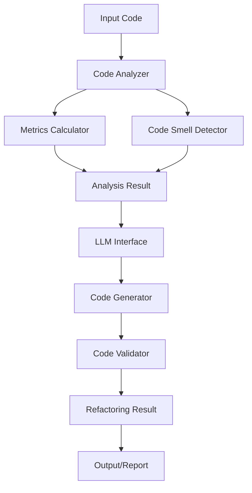

# 🔧 Python Code Refactoring System

> **An intelligent code refactoring system powered by Large Language Models (LLMs) that automatically detects code smells and suggests improvements while preserving functionality.**

[](https://python.org)
[](LICENSE)

## ✨ Features

### 🎯 **Core Capabilities**
- **Intelligent Code Analysis**: Detects various code smells and quality issues
- **LLM-Powered Refactoring**: Uses DeepSeek Coder for intelligent code improvements
- **Metrics Calculation**: Comprehensive code quality metrics (cyclomatic complexity, maintainability index, etc.)
- **Automated Validation**: Ensures refactored code maintains functionality and syntax correctness

### 🔍 **Code Smell Detection**
- **Long Methods**: Identifies methods that are too complex or lengthy
- **Large Classes**: Detects classes with too many responsibilities
- **Long Parameter Lists**: Finds functions with excessive parameters
- **Code Duplication**: Identifies repeated code patterns
- **Complex Conditionals**: Detects overly complex conditional logic

### 📊 **Quality Metrics**
- Cyclomatic Complexity
- Cognitive Complexity
- Maintainability Index
- Halstead Volume
- Lines of Code Analysis
- Code Duplication Ratio

### 🛠️ **Refactoring Types**
- Extract Method
- Extract Class
- Rename Variables
- Simplify Conditionals
- Remove Duplicates

## 🚀 Quick Start

### Prerequisites

```bash
# Python 3.8 or higher
python --version

# GPU support (optional but recommended)
nvidia-smi
```

### Installation

1. **Clone the repository:**
```bash
git clone https://github.com/poly-sladkiy/polyfactor.git
cd polyfactor
```

2. **Install dependencies:**
```bash
pip install -r requirements.txt
```

3. **Run the demo:**
```bash
python refactor.py
```

## 💡 Usage

### Command Line Interface

#### 📊 **Analyze Code**
```bash
# Analyze a single file
python refactor.py analyze my_script.py

# Scan entire directory
python refactor.py scan ./src
```

#### 🔧 **Refactor Code**
```bash
# Refactor with automatic save and report generation
python refactor.py refactor my_script.py --save --report

# Refactor without saving (preview mode)
python refactor.py refactor my_script.py
```

#### ⚙️ **Configuration Management**
```bash
# Show current configuration
python refactor.py config show

# Create default configuration file
python refactor.py config create
```

### Python API

```python
from refactoring_system import RefactoringSystem
from llm_manager import LLMConfig

# Initialize the system
config = LLMConfig(
    model_name="deepseek-ai/deepseek-coder-1.3b-instruct",
    temperature=0.1
)
system = RefactoringSystem(config)

# Analyze a file
analysis = system.analyze_file("my_script.py")
print(f"Found {len(analysis.code_smells)} issues")

# Perform refactoring
results = system.refactor_file("my_script.py", max_issues=3)
successful = [r for r in results if r.success]
print(f"Successfully refactored {len(successful)} issues")

# Save results
system.save_refactored_code("my_script.py", results, backup=True)

# Generate report
report = system.generate_report("my_script.py", analysis, results)
```

## 📖 Examples

### Basic Analysis

```python
# Example problematic code
def process_user_data(name, email, age, address, phone, is_active, role, dept):
    if name is None or name == "":
        return None
    if email is None or "@" not in email:
        return None
    if age is None or age < 0 or age > 150:
        return None
    # ... more validation logic
    
    user_data = {}
    user_data["name"] = name.strip().lower()
    user_data["email"] = email.strip().lower()
    # ... more processing
    return user_data
```

**Analysis Results:**
- ✅ **Long Parameter List**: 8 parameters detected
- ✅ **Long Method**: 25+ lines, high complexity
- ✅ **Code Duplication**: Repeated validation patterns

### After Refactoring

```python
@dataclass
class UserData:
    name: str
    email: str
    age: int
    address: str
    phone: str
    is_active: bool
    role: str
    department: str

class UserValidator:
    @staticmethod
    def validate_name(name: str) -> bool:
        return name and name.strip()
    
    @staticmethod
    def validate_email(email: str) -> bool:
        return email and "@" in email

def process_user_data(user_data: UserData) -> Optional[Dict[str, Any]]:
    validator = UserValidator()
    
    if not validator.validate_name(user_data.name):
        return None
    if not validator.validate_email(user_data.email):
        return None
    
    return {
        "name": user_data.name.strip().lower(),
        "email": user_data.email.strip().lower(),
        # ... processed data
    }
```

## 🏗️ Architecture



### Core Components

- **`RefactoringSystem`**: Main orchestrator
- **`CodeAnalyzer`**: Analyzes code quality and detects issues
- **`LLMInterface`**: Manages communication with language models
- **`CodeGenerator`**: Generates improved code suggestions
- **`CodeValidator`**: Validates syntax and functionality preservation
- **`MetricsCalculator`**: Computes various code quality metrics

## 🔧 Configuration

Create a `refactor_config.json` file:

```json
{
  "llm": {
    "model_name": "deepseek-ai/deepseek-coder-1.3b-instruct",
    "device": "auto",
    "temperature": 0.1,
    "max_length": 4096
  },
  "analysis": {
    "max_issues_per_file": 3,
    "min_confidence": 0.7,
    "severity_filter": ["medium", "high", "critical"]
  },
  "output": {
    "create_backup": true,
    "generate_report": true,
    "format_code": true
  }
}
```

## 📊 Metrics & Reporting

The system generates comprehensive reports including:

### Quality Metrics Comparison
| Metric | Before | After | Improvement |
|--------|--------|-------|-------------|
| Cyclomatic Complexity | 15 | 8 | +46.7% |
| Maintainability Index | 42.3 | 68.9 | +62.9% |
| Lines of Code | 120 | 95 | +20.8% |
| Code Duplication | 30% | 5% | +83.3% |

### Detected Issues
- **Long Method** (lines 15-45): Method has 30+ lines, complexity 12
- **Parameter List** (line 15): Method has 8 parameters
- **Code Duplication** (lines 20-25, 35-40): Repeated validation logic
- 
## 🛡️ Safety Features

- **Automatic Backups**: Creates `.backup` files before modification
- **Syntax Validation**: Ensures generated code is syntactically correct
- **Functionality Preservation**: Validates that refactored code maintains original behavior
- **Rollback Capability**: Easy restoration from backups

## 🔄 Workflow

1. **📖 Analysis**: Scan code for quality issues and calculate metrics
2. **🎯 Detection**: Identify code smells and prioritize by severity
3. **🤖 Generation**: Use LLM to generate improved code
4. **✅ Validation**: Verify syntax and functionality preservation
5. **💾 Application**: Save results with automatic backup
6. **📊 Reporting**: Generate comprehensive improvement reports

## 📦 Dependencies

### Core Dependencies
- `transformers>=4.52.4` - Hugging Face transformers for LLM integration
- `torch>=2.7.1` - PyTorch for model execution
- `loguru>=0.7.3` - Enhanced logging
- `black>=25.1.0` - Code formatting
- `isort>=6.0.1` - Import sorting

## 🚧 Development

### Setting up Development Environment

```bash
# Clone and setup
git clone https://github.com/yourusername/python-refactor-system.git
cd python-refactor-system

# Create virtual environment
python -m venv .venv
source .venv/bin/activate  # On Windows: .venv\Scripts\activate

# Install dependencies
pip install -r requirements.txt

# Install development dependencies
pip install -r requirements-dev.txt
```

## 🤝 Contributing

We welcome contributions! Please see our [Contributing Guide](CONTRIBUTING.md) for details.

1. Fork the repository
2. Create your feature branch (`git checkout -b feature/amazing-feature`)
3. Commit your changes (`git commit -m 'Add amazing feature'`)
4. Push to the branch (`git push origin feature/amazing-feature`)
5. Open a Pull Request

## 📄 License

This project is licensed under the MIT License - see the [LICENSE](LICENSE) file for details.

## 🙏 Acknowledgments

- **DeepSeek AI** for the excellent code generation model
- **Hugging Face** for the transformers library
- **Python Software Foundation** for the AST module
- **Black** and **isort** for code formatting tools

## 📞 Support

- 🐛 **Issues**: [GitHub Issues](https://github.com/poly-sladkiy/polyfactor/issues)
- 💬 **Discussions**: [GitHub Discussions](https://github.com/poly-sladkiy/polyfactor/discussions)

---

<div align="center">
<strong>Made with ❤️</strong>
<br>
<em>Helping developers write better code, one refactor at a time</em>
</div>
